# ELECTION REST API

A formal and organized choice by vote of a person for a political office or other position.

## Features

- Search: search topic by topic name using query parameter

  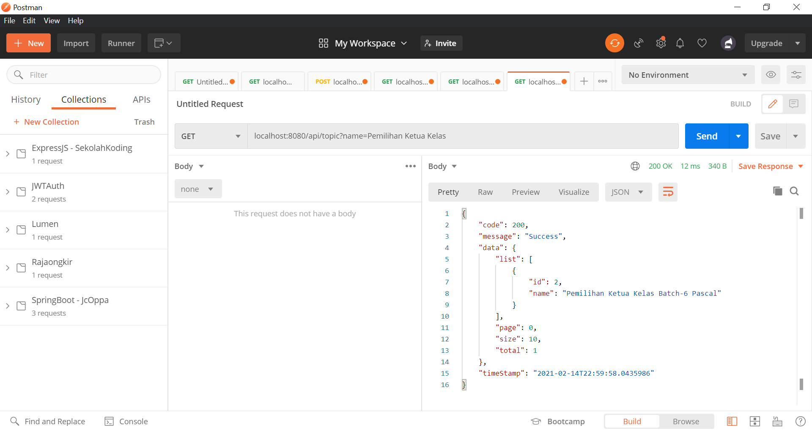

  

- Pagination: page numbering topic and sorting id by descending

  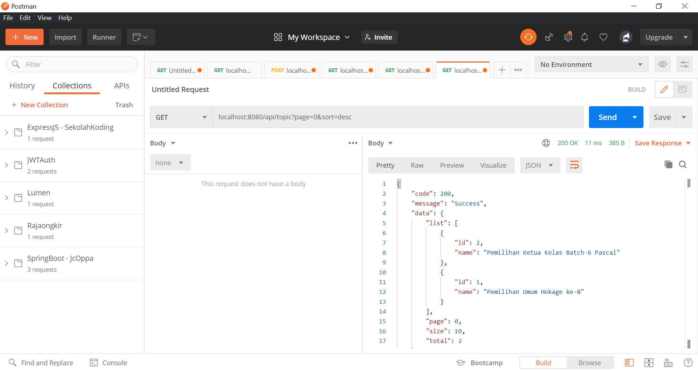

  

- Custom Validation Message Response

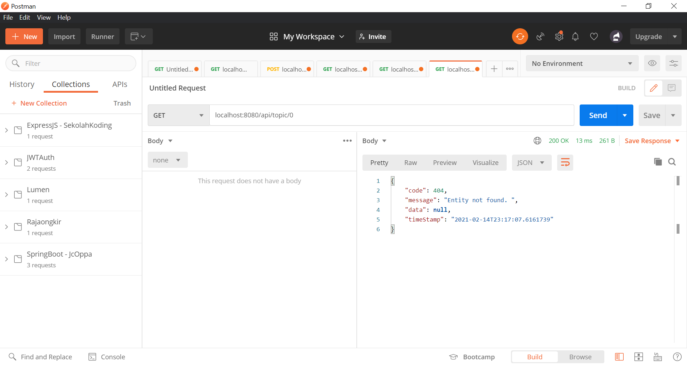

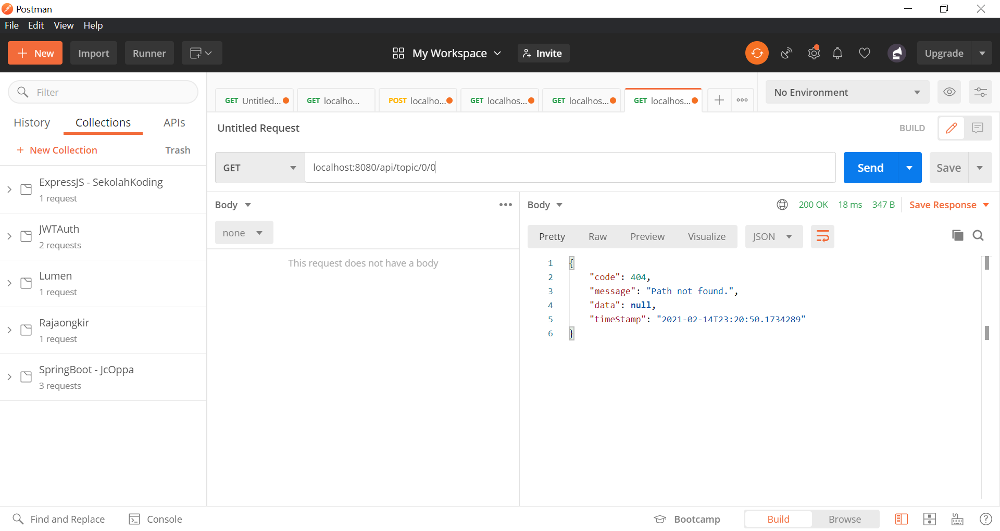

## Configuration

- Server port        : 8080
- MySQL port     : 3306
- Database name : enigma_example
- Context path     : /api

## API Swagger Documentation

This [URL](http://localhost:8080/api/documentation) can be used to access Swagger UI when the spring-boot application is run locally.

## Images Screenshot

Show all topics

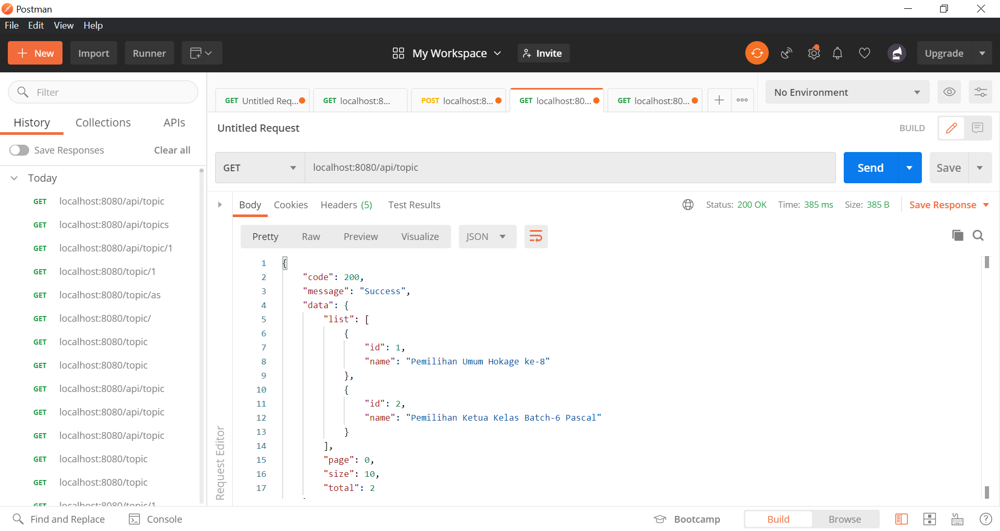

Find topic by id

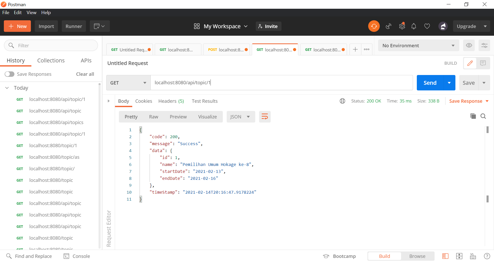

Add topic

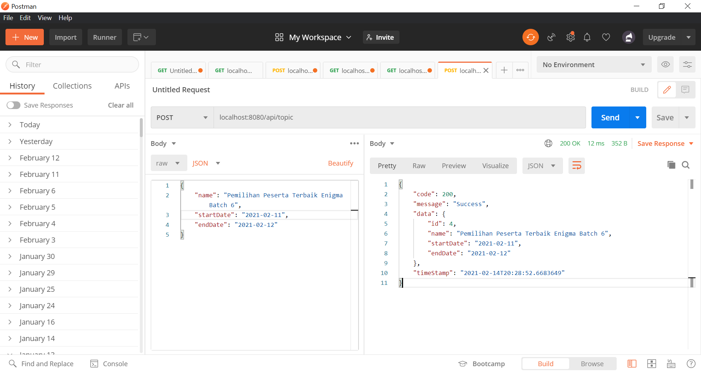

Delete topic

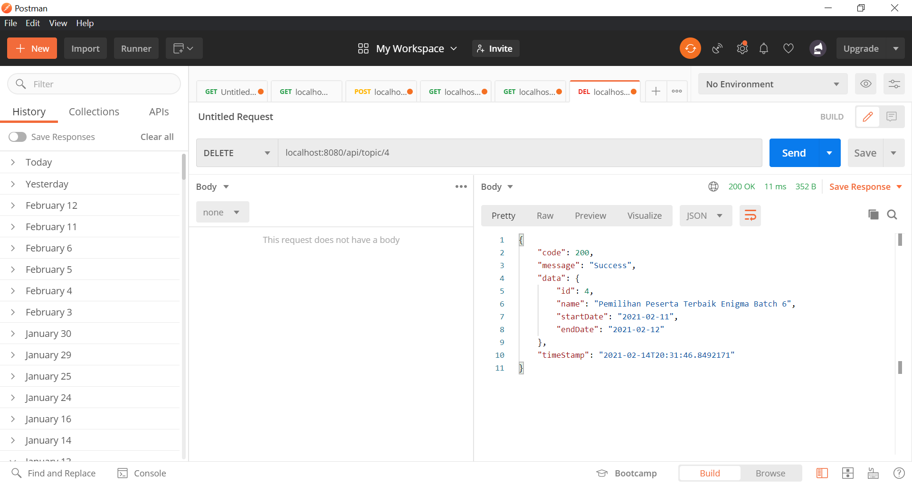

Search topic by name

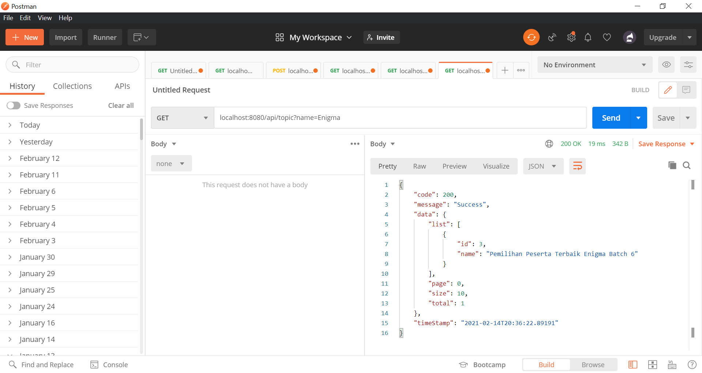

Show all candidates by topic

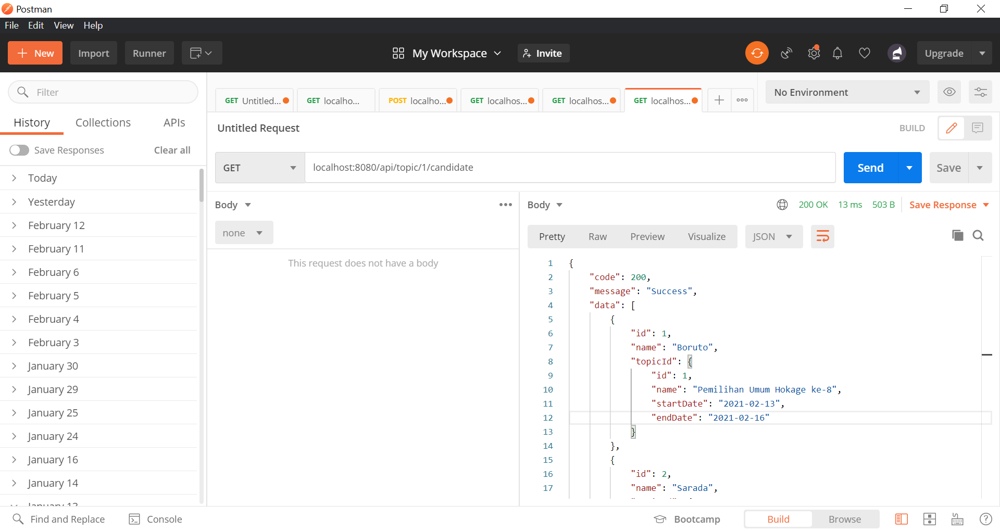

Add candidate

Find candidate by id

Edit candidate by id

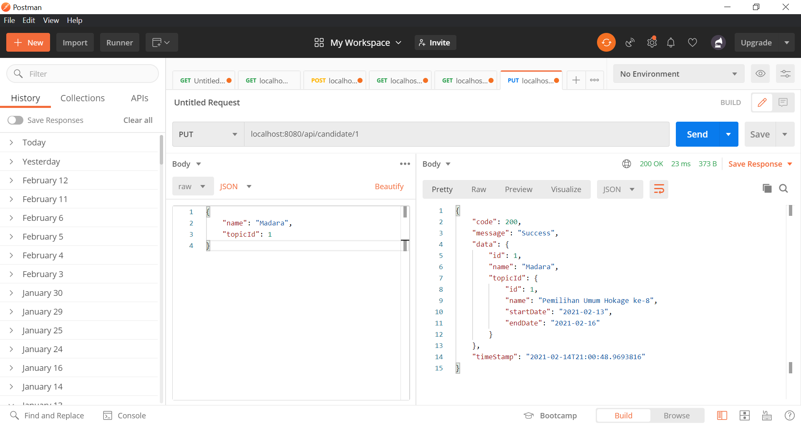

Delete candidate by id

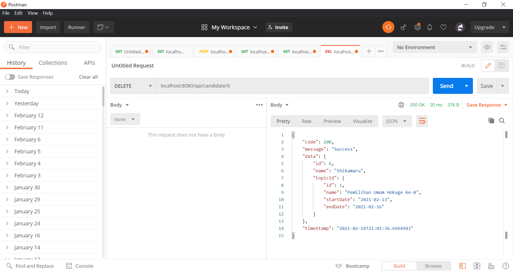

Show all elections by topic

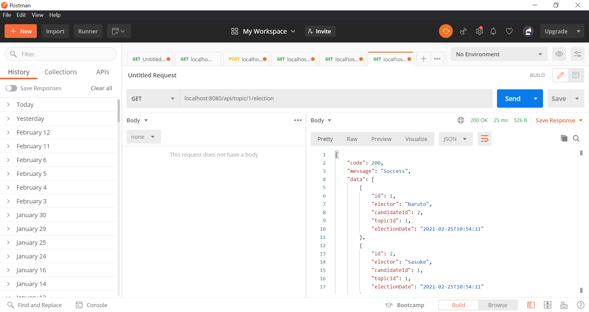

Election candidate by topic

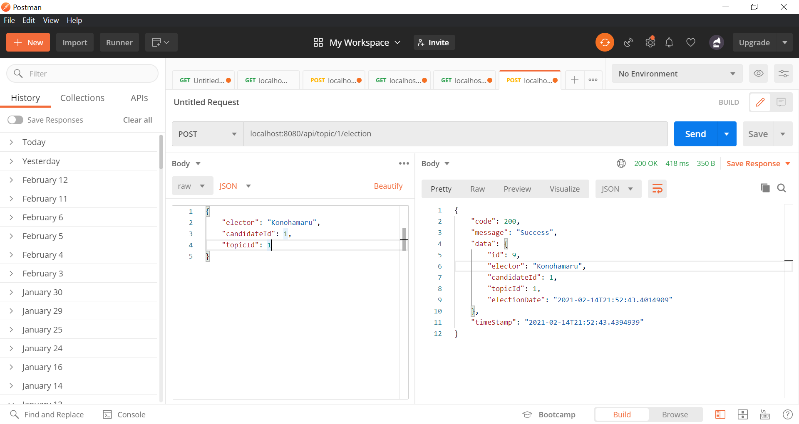

Results of all elections by topic 

